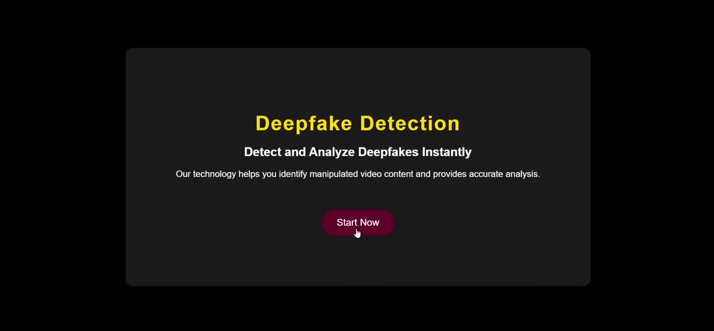
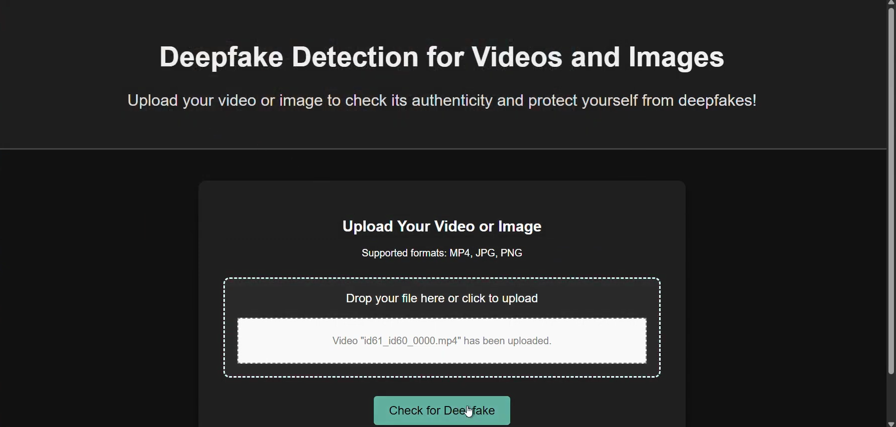
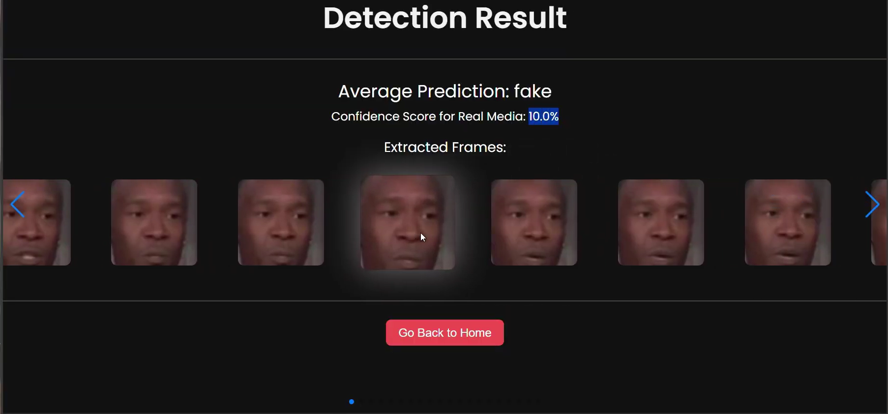
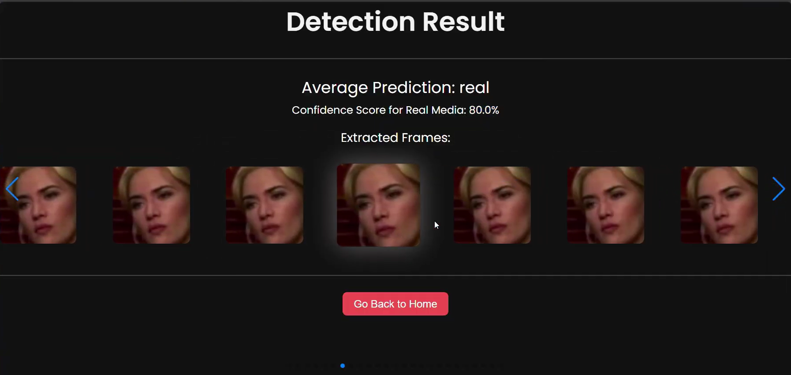

# Deepfake Detection System using CNN

A web-based Deepfake Detection system that allows users to upload images or videos and determine whether the media is real or manipulated using a Convolutional Neural Network (CNN).

This project combines **Computer Vision, Deep Learning, and Web Development** to provide an accessible tool for identifying manipulated media.

---

# Overview

Deepfakes are synthetic media generated using deep learning techniques that can manipulate faces in images or videos. This project focuses on detecting such manipulated media using a **custom Convolutional Neural Network (CNN)** trained to identify subtle inconsistencies in facial features.

The system provides a simple **Flask web interface** where users can upload media files, and the model analyzes the content to classify it as **real or fake**.

---

# Features

• Upload images or videos for deepfake analysis  
• Automatic frame extraction from videos  
• Face detection using OpenCV  
• CNN-based classification of real vs fake media  
• Display extracted frames from videos  
• Confidence score for prediction results  
• Web interface built using Flask  

---

# System Architecture

The system follows this pipeline:

1. User uploads an image or video through the web interface
2. If video → frames are extracted
3. Face detection is performed using OpenCV Haar Cascade
4. Faces are preprocessed and resized to 128x128
5. CNN model performs classification
6. System displays prediction results and confidence score

---

# Model Architecture

The Deepfake detection model uses a **Convolutional Neural Network (CNN)** built using PyTorch.

Architecture:

Input Image: **128 × 128 × 3**

Conv Layer 1  
• 32 filters (3×3)  
• ReLU activation  
• MaxPooling

Conv Layer 2  
• 64 filters (3×3)  
• ReLU activation  
• MaxPooling

Conv Layer 3  
• 128 filters (3×3)  
• ReLU activation  
• MaxPooling

Fully Connected Layers  
• Dense layer (512 neurons)  
• Dropout (0.5)  
• Output layer (2 classes: Real / Fake)

The model is trained using:

• Loss Function: CrossEntropyLoss  
• Optimizer: Adam  
• Epochs: 30  
• Batch Size: 32  

---

# Dataset

The model was trained using labeled face images extracted from real and fake videos.

Dataset structure:
```
dataset/
├── real/
│ ├── video1/
│ ├── video2/
│
├── fake/
│ ├── video1/
│ ├── video2/
```

Images are resized and normalized before being fed into the CNN model.

---

# Web Application

The project includes a Flask-based web application that allows users to interact with the model.

Users can:

• Upload image files (JPG, PNG)  
• Upload video files (MP4)  
• View extracted frames  
• See prediction results with confidence score  

---

# Project Structure
```
deepfake-detection/
│
├── app.py
├── utils/
│ └── video_processing.py
│
├── model/
│ └── deepfake_cnn.pth
│
├── templates/
│ ├── index.html
│ ├── upload.html
│ └── result.html
│
├── static/
│ ├── extracted_frames/
│ ├── script.js
│ ├── style_index.css
│ ├── style_upload.css
│ └── style_result.css
│
└── uploads/
```

---

# Technologies Used

Python  
PyTorch  
OpenCV  
Flask  
HTML / CSS / JavaScript  
NumPy  
Pillow  

---

# Results

The system analyzes uploaded media and outputs:

• Prediction result (Real / Fake)
• Confidence score  
• Extracted frames from video  

## Application Screenshots

### Home Page
<p align="center">
  
</p>

### Upload Page
<p align="center">
  
</p>

### Result Page
<p align="center">
  
</p>

<p align="center">
  
</p>

# Research Publication

This project is based on the research work:

**"A CNN Algorithm Based Deepfake Detection System"**

The work demonstrates the effectiveness of CNN models in detecting manipulated facial media.

---

# Copyright Notice

The project titled **"A CNN Algorithm Based Deepfake Detection Model"** is registered under the Government of India Copyright Act.

This repository contains the **web implementation and system overview for demonstration purposes.**

---

# Future Improvements

• Use advanced architectures such as ResNet or EfficientNet  
• Improve real-time detection performance  
• Add LSTM layers for temporal analysis in videos  
• Deploy the system as a cloud-based service  

---

# Author

Meet Mistry  
Computer Engineering Student  
Machine Learning & AI Enthusiast
